# Kairos Architecture

Kairos is a **contextual bandit** that learns **when** to surface bookmark *clusters* — not a search engine, not a cron digest. Silence (`KAIROS_OK`) is the default; interrupt only when calendar capacity, topical fit, and learned engagement align.

This document maps the running system in `src/kairos/`. For product thesis and build order, see [PLAN.md](../PLAN.md).

---

## System overview

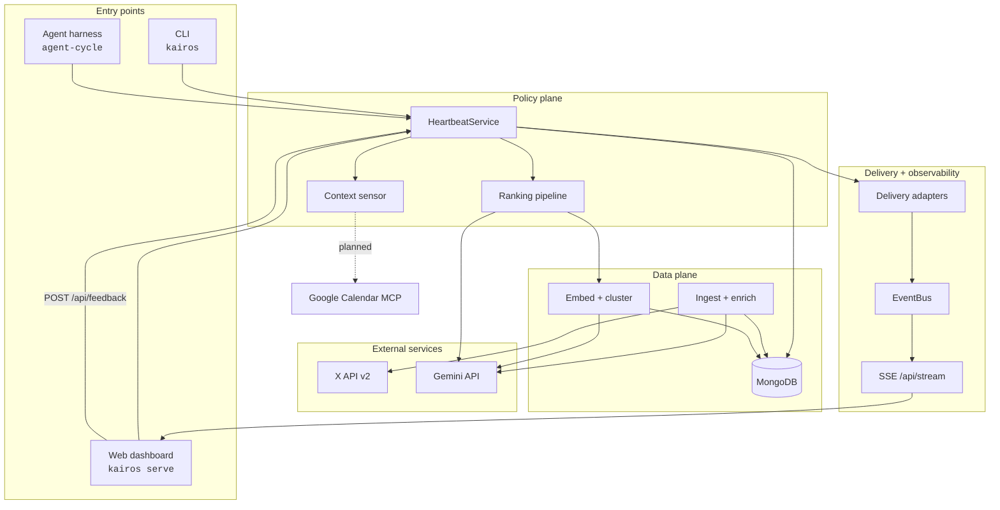

---

## Layer model

| Layer | Responsibility | Key modules |
|-------|----------------|-------------|
| **Ingest** | Pull X bookmarks, normalize, enrich | `ingest/`, `bookmarks/enrich.py` |
| **Index** | Embed, cluster, fingerprint stale rows | `embeddings/`, `bookmarks/index.py` |
| **Context** | Headspace vector at decision time | `core/context.py`, `core/moment.py` |
| **Policy** | Rank, gate, surface or silence | `core/ranking.py`, `core/bandit.py` |
| **Delivery** | Fan-out to web, OS, host transcript | `delivery/` |
| **Feedback** | Implicit signals → online bandit | `core/feedback.py`, `db/feedback.py` |
| **Observability** | Live activity stream | `observability/bus.py`, `web/app.py` |

---

## 1. Ingest layer

Pulls bookmarks from X, normalizes API payloads, enriches with Gemini metadata, and upserts into MongoDB.

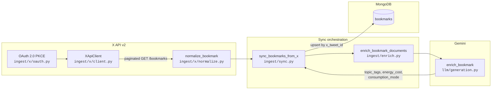

**Enrichment output** (`BookmarkEnrichment`): topic tags, consumption mode, energy cost, geo anchor, perishability.

**CLI:** `kairos x auth`, `kairos x sync`, `kairos bookmarks enrich`

---

## 2. Embed + cluster (index layer)

One fixed vector space (config-driven). Fingerprints skip unchanged rows. HDBSCAN groups bookmarks into topic clusters.

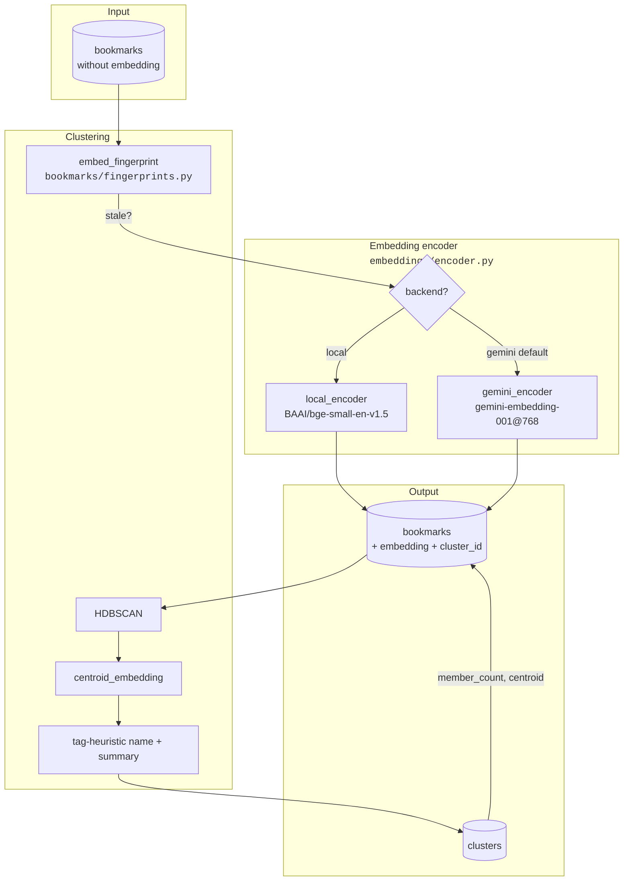

**Incremental pipeline** (`bookmarks/pipeline.py`): sync → enrich → embed → cluster (skips re-cluster when fingerprints unchanged).

**CLI:** `kairos bookmarks embed`, `kairos bookmarks cluster`, `kairos bookmarks clusters`

---

## 3. Context sensor

Two dimensions drive the policy: **topical affinity** (what you're oriented toward) and **attention capacity** (whether interrupt is feasible).

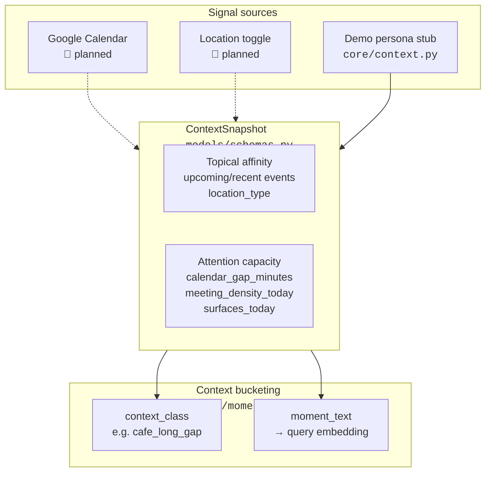

| Field | Role |
|-------|------|
| `calendar_gap_minutes` | Gate: min gap before interrupt |
| `location_type` | Topical mode (desk, cafe, gym, …) |
| `surfaces_today` | Daily budget / fatigue |
| `time_since_last_surface_minutes` | Min gap between surfaces |

---

## 4. Ranking pipeline

The thesis lives here: moment → cluster fit × learned bandit weight → interrupt gate → digest or silence.

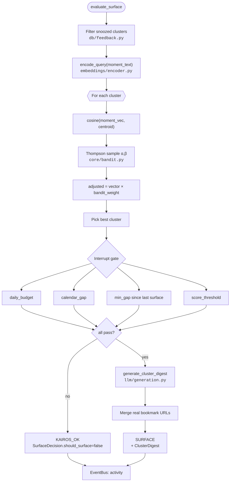

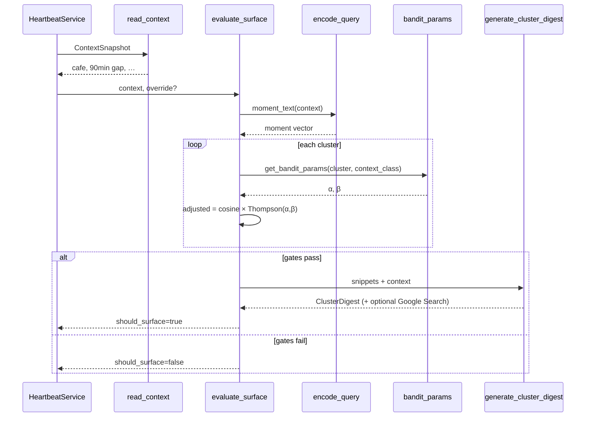

**Module map:** `core/ranking.py` · `core/bandit.py` · `core/moment.py` · `db/bandit.py` · `db/clusters.py`

---

## 5. HeartbeatService (policy core)

Single orchestrator for every runtime path — CLI, web, agent, MCP.

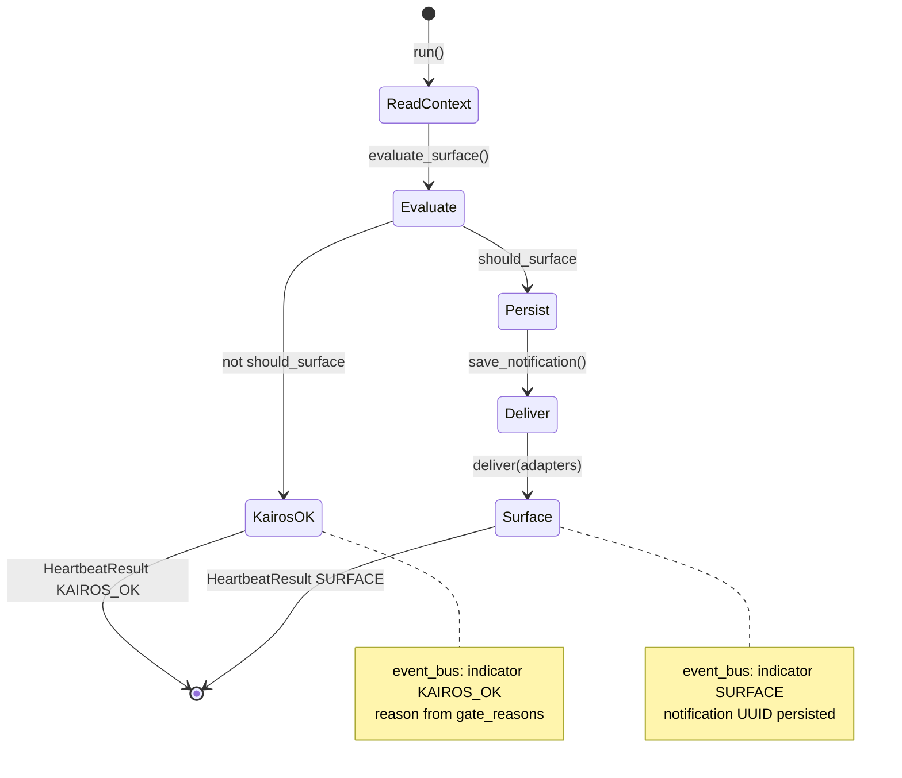

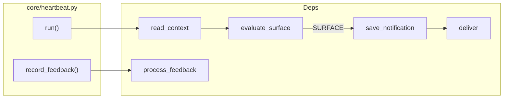

**Contract:** `HeartbeatResult` — same shape for HTTP, CLI JSON, and future MCP.

---

## 6. Delivery layer

Adapters fan out surfaced digests without changing policy logic.

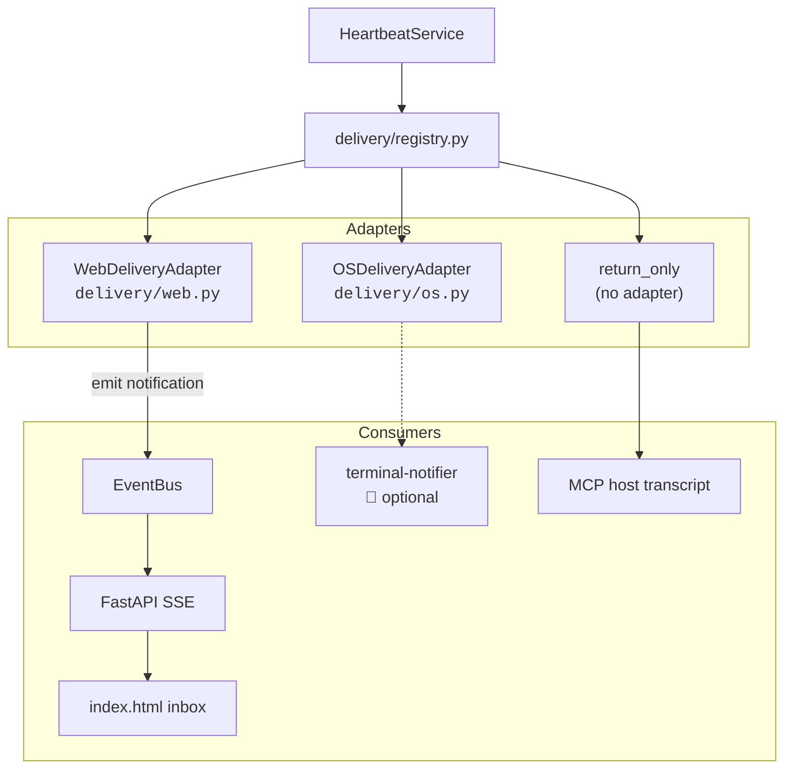

**Render:** `delivery/render.py` — markdown digest + delivery hints for host agents.

---

## 7. Feedback loop + contextual bandit

Online learning without LLM fine-tuning. Snooze ≠ dismiss.

```mermaid
flowchart TB
    subgraph UI["User actions"]
        Snooze["Snooze 2h"]
        Dismiss["Not relevant"]
        Click["Link click"]
    end

    subgraph API
        POST["POST /api/feedback<br/>kairos feedback"]
    end

    subgraph Process["process_feedback<br/><code>core/feedback.py</code>"]
        Lookup["get_notification"]
        Reward["reward_for_action<br/><code>core/rewards.py</code>"]
        Insert["insert_feedback_event"]
        Update["apply_bandit_reward"]
        Status["update_notification_status"]
    end

    subgraph Mongo[(MongoDB)]
        FE[("feedback_events")]
        BP[("bandit_params")]
        NT[("notifications")]
    end

    Snooze --> POST
    Dismiss --> POST
    Click --> POST

    POST --> Lookup --> Reward
    Reward --> Insert --> FE
    Reward -->|"reward ≠ null"| Update --> BP
    Reward -->|"snooze: null reward"| Status
    Update --> Status --> NT
```

**Reward table**

| Action | Reward | Bandit update |
|--------|--------|---------------|
| `acted` | +1.0 | α += 1.0 |
| `link_click` | +0.8 | α += 0.8 |
| `expanded` | +0.4 | α += 0.4 |
| `snoozed` | — | Exclude cluster from ranking (TTL) |
| `dismissed` | −0.4 | β += 0.4 |
| `ignored` | −0.6 | β += 0.6 |

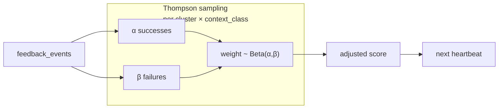

---

## 8. Observability + web gateway

In-process pub/sub streams agent activity to the dashboard admin panel.

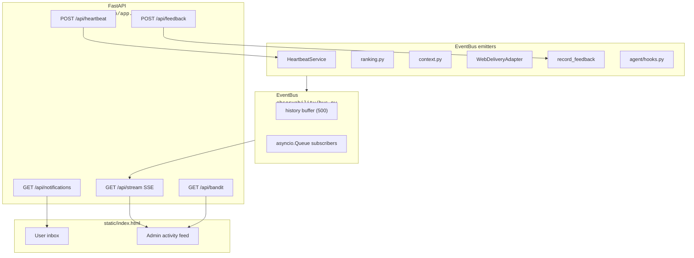

**Event kinds:** `session`, `context`, `activity`, `indicator`, `notification`, `feedback`, `turn`, `cluster`, `search`

---

## 9. Agent harness

Two runtime paths share `HeartbeatService`.

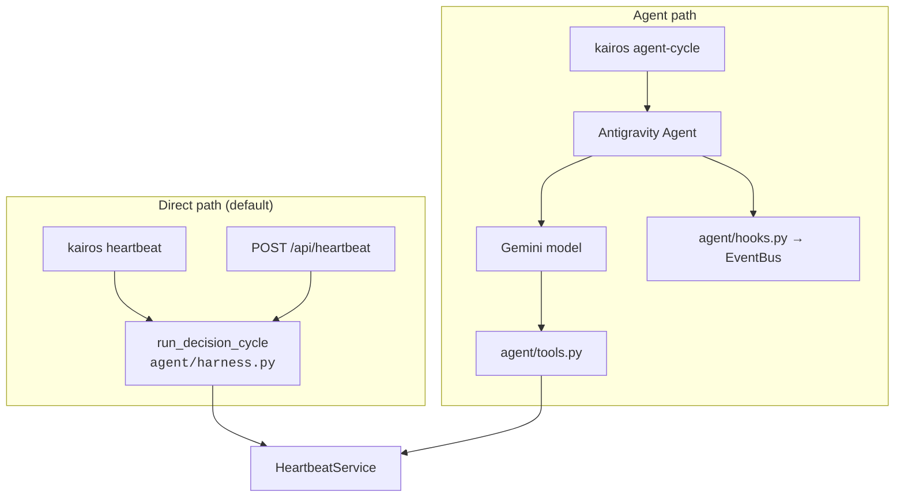

| Tool | Status | Purpose |
|------|--------|---------|
| `run_heartbeat` | ✅ | Policy cycle |
| `get_current_context` | ✅ | Headspace vector |
| `get_cluster_summary` | ✅ | Topic → cluster lookup |
| `record_feedback` | ✅ | Bandit update |
| `get_relevant_bookmarks` | 🚧 stub | Search (not thesis) |
| `ingest_bookmark` | ✅ | Manual URL ingest |

---

## 10. CLI surface

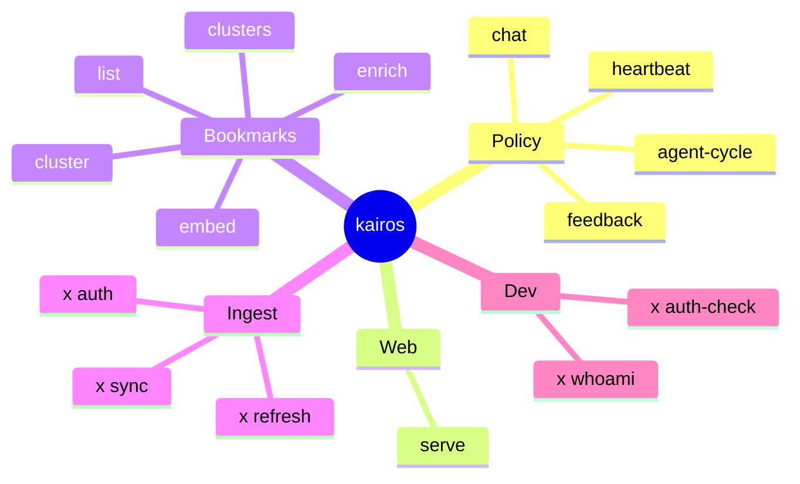

---

## 11. MongoDB collections

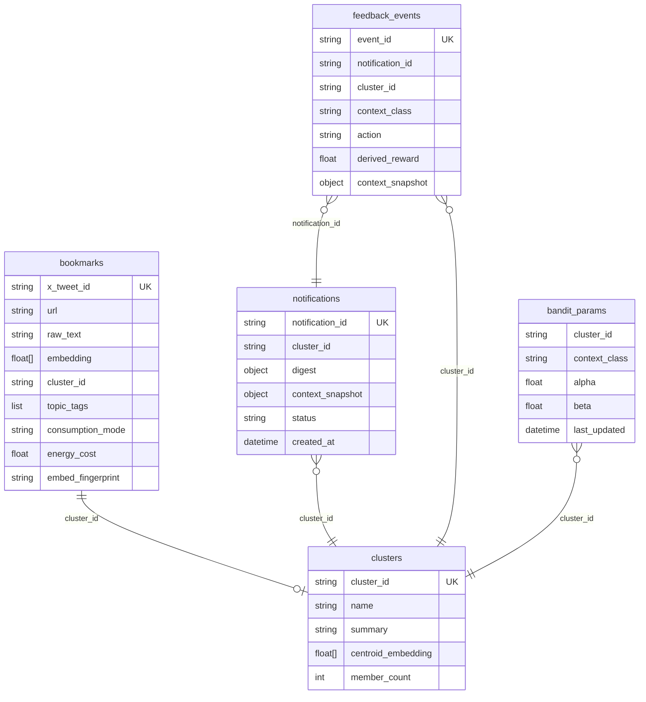

**Planned (P7):** `optimization_runs` — GEPA prompt diffs from nightly eval.

---

## 12. LLM layer

All structured generation goes through the Gemini Interactions API.

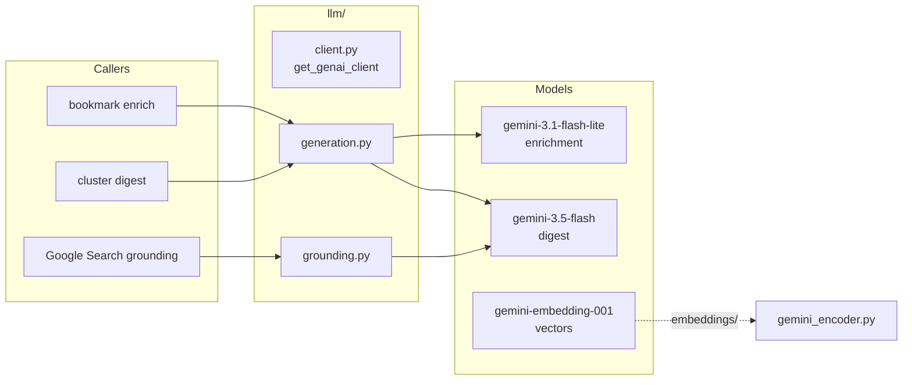

**Digest modes:** structured `ClusterDigestCore` + optional `DIGEST_USE_GOOGLE_SEARCH` for live web context.

---

## 13. Self-improvement (planned P7)

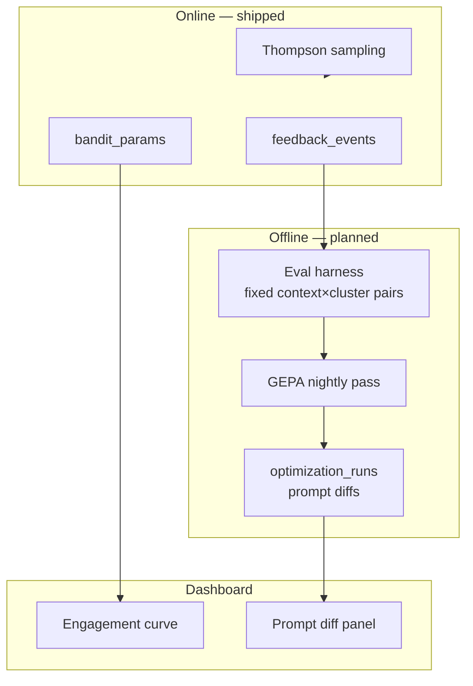

**Honest scope:** policy RSI at the application layer (bandit + prompt meta-optimization). No LLM weight training.

---

## 14. End-to-end lifecycle

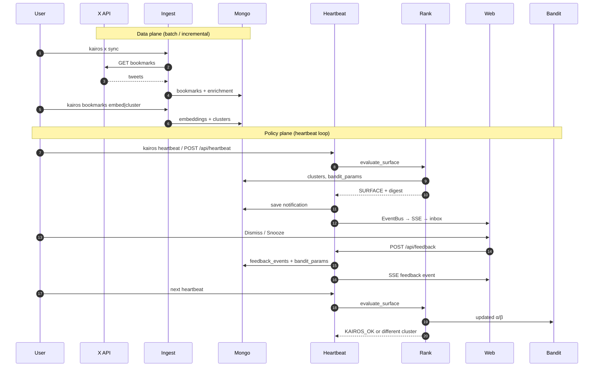

---

## 15. Configuration

Central settings in `config.py` (env + `.env`):

| Setting | Default | Effect |
|---------|---------|--------|
| `EMBEDDING_BACKEND` | `gemini` | Vector encoder dispatch |
| `DAILY_SURFACE_BUDGET` | `3` | Max surfaces / day |
| `SURFACE_SCORE_THRESHOLD` | `0.12` | Min adjusted score |
| `MIN_CALENDAR_GAP_MINUTES` | `30` | Attention capacity gate |
| `SNOOZE_TTL_MINUTES` | `120` | Snooze exclusion window |
| `DIGEST_USE_GOOGLE_SEARCH` | `true` | Ground digest with web |
| `DELIVERY_TARGETS` | `web` | Adapter fan-out |

---

## Module index

```
src/kairos/
├── cli.py                 # CLI entry
├── config.py              # Settings
├── agent/                 # Antigravity harness + tools
├── bookmarks/             # Enrich, embed, cluster, pipeline
├── core/                  # Policy: context, ranking, bandit, feedback
├── db/                    # MongoDB repositories
├── delivery/              # Web + OS adapters
├── embeddings/            # Local + Gemini encoders
├── ingest/                # X OAuth, sync, normalize
├── llm/                   # Gemini generation + grounding
├── models/                # Pydantic schemas
├── observability/         # EventBus
└── web/                   # FastAPI + static dashboard
```

---

## Related docs

- [PLAN.md](../PLAN.md) — product thesis and build order
- [demo-readiness/FAQ.md](demo-readiness/FAQ.md) — judge Q&A
- [demo-readiness/PHASE_REVIEWS.md](demo-readiness/PHASE_REVIEWS.md) — adversarial phase log
- [demo-readiness/THEME_LOG.md](demo-readiness/THEME_LOG.md) — hackathon theme proofs
