# Kairos Architecture

Kairos is a **contextual bandit** that learns **when** to surface bookmark *clusters* — not a search engine, not a cron digest. Silence (`KAIROS_OK`) is the default; interrupt only when calendar capacity, topical fit, and learned engagement align.

This document maps the running system in `src/kairos/`. For product thesis and build order, see [PLAN.md](../PLAN.md).

---

## System overview

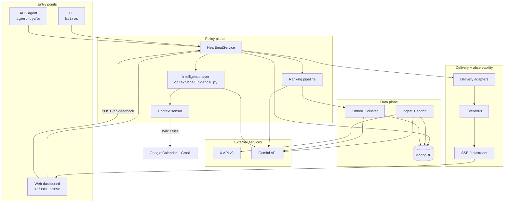

---

## Layer model

| Layer | Responsibility | Key modules |
|-------|----------------|-------------|
| **Ingest** | Pull X bookmarks, normalize, enrich | `ingest/`, `bookmarks/enrich.py` |
| **Index** | Embed, cluster, fingerprint stale rows | `embeddings/`, `bookmarks/index.py` |
| **Context** | Headspace vector at decision time | `core/context.py`, `core/headspace.py`, `core/moment.py` |
| **Intelligence** | Gemini enrichment before policy | `core/intelligence.py`, `llm/compose.py`, `llm/generation.py` |
| **Policy** | Rank, gate, surface or silence | `core/ranking.py`, `core/bandit.py` |
| **Delivery** | Fan-out to web, OS, host transcript | `delivery/` |
| **Feedback** | Implicit signals → online bandit | `core/feedback.py`, `db/feedback.py` |
| **Observability** | Live activity stream | `observability/bus.py`, `web/app.py` |

---

## 1. Ingest layer

Pulls bookmarks from X, normalizes API payloads, and upserts into MongoDB. **Enrichment is off during sync by default** — run `kairos bookmarks prep` or `kairos bookmarks enrich` separately.

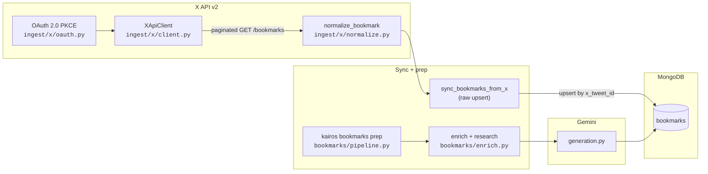

**Enrichment output** (`BookmarkEnrichment`): topic tags, consumption mode, energy cost, geo anchor, perishability.

**CLI:** `kairos x auth`, `kairos x sync`, `kairos bookmarks prep` (preferred), `kairos bookmarks enrich`

---

## 2. Embed + cluster (index layer)

One fixed vector space (config-driven). Fingerprints skip unchanged rows. HDBSCAN groups bookmarks into topic clusters.

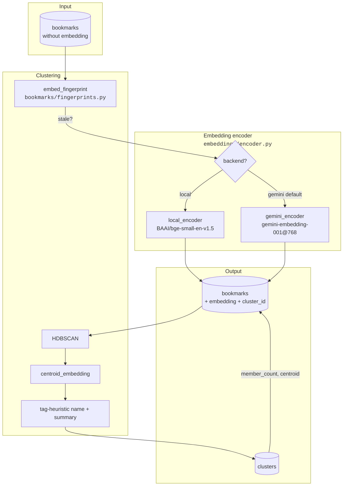

**Incremental pipeline** (`bookmarks/pipeline.py`): optional X sync → enrich → research → embed → cluster. Skips re-cluster when no new embeddings and no unclustered rows. Stable cluster IDs when centroid reuse ≥ `CLUSTER_ID_REUSE_THRESHOLD`.

**Background prep:** `POST /api/prep/start` → `dispatch_prep_job` (FastAPI background or Arq worker). Status in Mongo `prep_jobs`.

**CLI:** `kairos bookmarks prep`, `kairos bookmarks embed`, `kairos bookmarks cluster`, `kairos bookmarks clusters`

---

## 3. Context sensor + intelligence layer

Two dimensions drive the policy: **topical affinity** (what you're oriented toward) and **attention capacity** (whether interrupt is feasible). Raw sensors are fused heuristically, then **Gemini enriches** the snapshot before ranking.

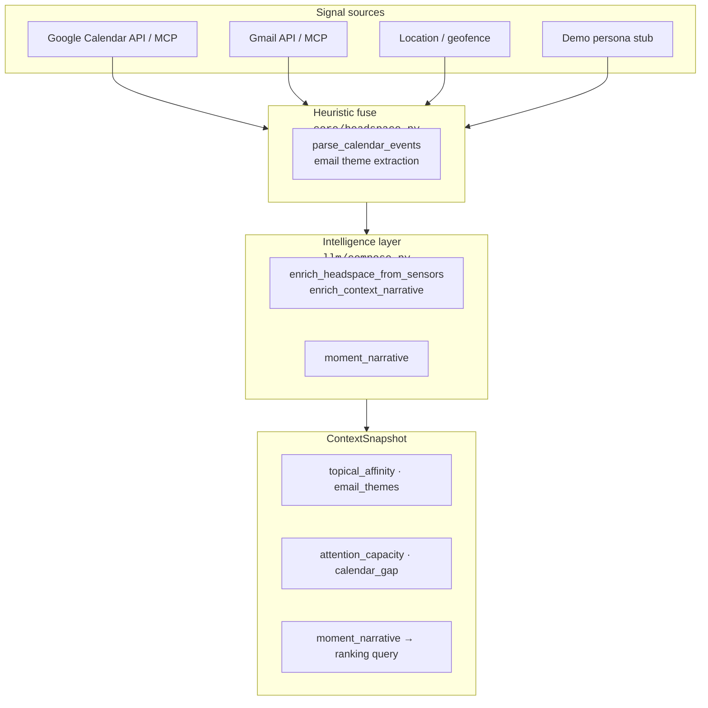

| Field | Role |
|-------|------|
| `calendar_gap_minutes` | Hard gate: min gap before interrupt |
| `moment_narrative` | LLM-composed query text for vector match (replaces template `moment_text`) |
| `topical_affinity` / `attention_capacity` | LLM-refined modes (heuristic fallback) |
| `surfaces_today` | Daily budget / fatigue |

**Sync paths:** `sync_google_headspace` and `fuse_headspace_context` call `fuse_headspace_intelligent` when `INTELLIGENCE_HEADSPACE_ENABLED=true`. Every heartbeat tick runs `prepare_context_for_decision` to compose `moment_narrative` if missing.

---

## 4. Ranking pipeline

The thesis lives here: enriched moment → cluster fit × learned bandit weight → hard gates → **LLM moment-fit** → multi-step digest or silence.

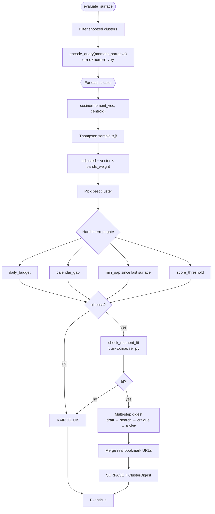

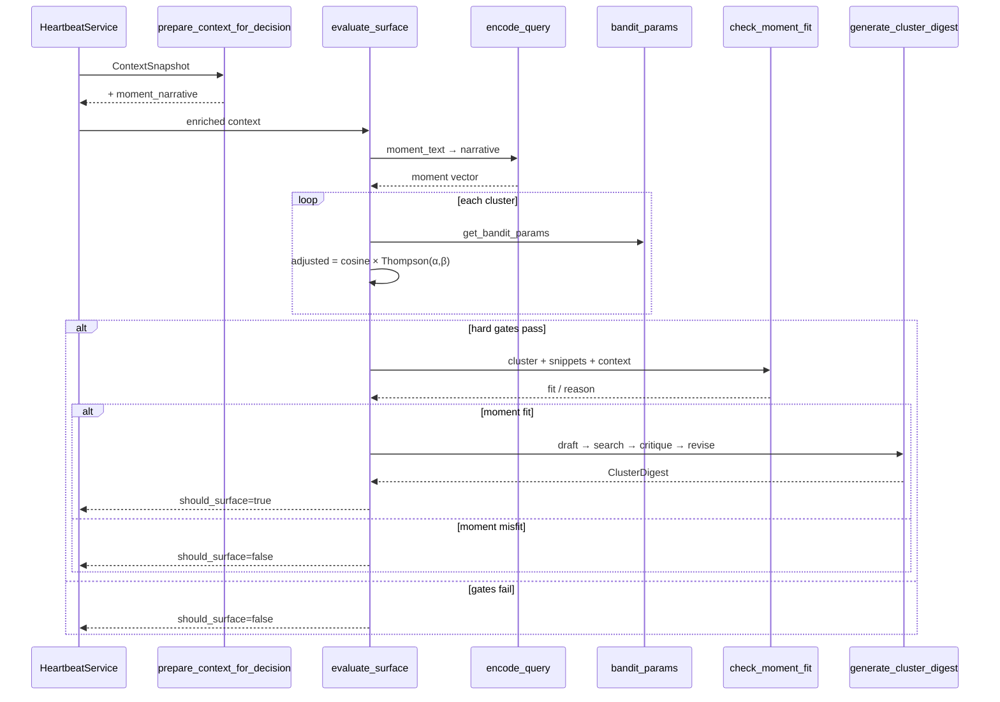

**Module map:** `core/ranking.py` · `core/bandit.py` · `core/moment.py` · `llm/compose.py` · `llm/generation.py` · `db/bandit.py`

**Policy vs intelligence:** bandit + hard gates stay deterministic. Gemini adds narrative enrichment (every tick), moment-fit check (surface path only), and digest quality (surface path only).

**Performance:** budget/gap gates run before vector encode + bandit batch fetch; moment-fit and digest only run when hard gates + score threshold pass. Cluster and bookmark ranking use Atlas `$vectorSearch` when indexes exist, with in-memory cosine fallback. Evergreen clusters skip Google Search grounding during digest (`digest_skip_search_evergreen`). Snooze is scoped per **user × context_class**.

---

## 5. HeartbeatService (policy core)

Single orchestrator for every runtime path — CLI, web, agent, MCP.

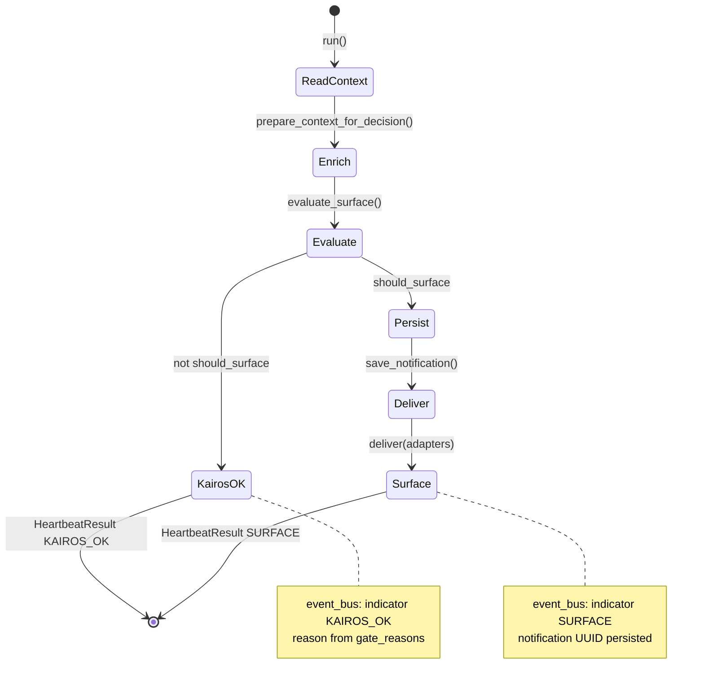

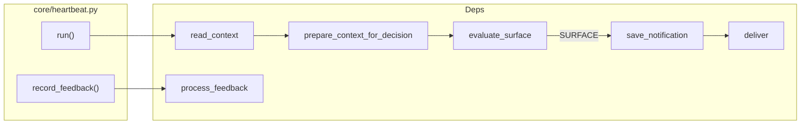

**Contract:** `HeartbeatResult` — same shape for HTTP, CLI JSON, MCP, and ADK agent.

All entry points (web, CLI, MCP `run_heartbeat`, ADK `agent-cycle`) call `HeartbeatService`, which runs the intelligence layer before policy. ADK orchestrates sensors + tools; policy + intelligence stay in the Python core.

---

## 6. Delivery layer

Adapters fan out surfaced digests without changing policy logic.

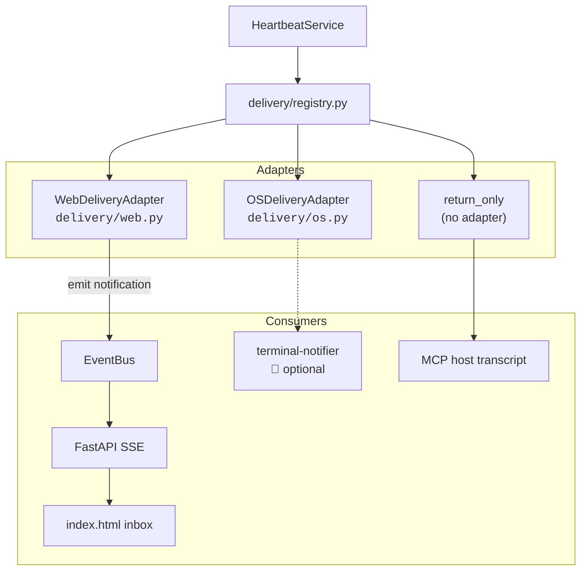

**Render:** `delivery/render.py` — markdown digest + delivery hints for host agents.

---

## 7. Feedback loop + contextual bandit

Online learning without LLM fine-tuning. Snooze ≠ dismiss. Bandit params are keyed by **user × cluster × context_class** (`user_id` from session or `KAIROS_USER_ID`).

```mermaid
flowchart TB
    subgraph UI["User actions"]
        Snooze["Snooze 2h"]
        Dismiss["Not relevant"]
        Click["Link click"]
    end

    subgraph API
        POST["POST /api/feedback<br/>kairos feedback"]
    end

    subgraph Process["process_feedback<br/><code>core/feedback.py</code>"]
        Lookup["get_notification"]
        Reward["reward_for_action<br/><code>core/rewards.py</code>"]
        Insert["insert_feedback_event"]
        Update["apply_bandit_reward"]
        Status["update_notification_status"]
    end

    subgraph Mongo[(MongoDB)]
        FE[("feedback_events")]
        BP[("bandit_params")]
        NT[("notifications")]
    end

    Snooze --> POST
    Dismiss --> POST
    Click --> POST

    POST --> Lookup --> Reward
    Reward --> Insert --> FE
    Reward -->|"reward ≠ null"| Update --> BP
    Reward -->|"snooze: null reward"| Status
    Update --> Status --> NT
```

**Reward table**

| Action | Reward | Bandit update |
|--------|--------|---------------|
| `acted` | +1.0 | α += 1.0 |
| `link_click` | +0.8 | α += 0.8 |
| `expanded` | +0.4 | α += 0.4 |
| `snoozed` | — | Exclude cluster from ranking (TTL) |
| `dismissed` | −0.4 | β += 0.4 |
| `ignored` | −0.6 | β += 0.6 |

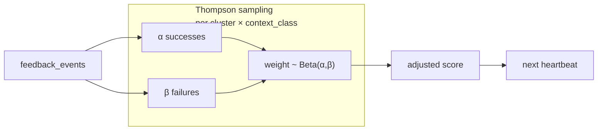

---

## 8. Observability + web gateway

In-process pub/sub streams agent activity to the dashboard admin panel. When `EVENT_PERSIST_ENABLED=true`, events are also written to Mongo `pipeline_events` (TTL) so CLI/MCP heartbeats appear in the admin log after browser refresh.

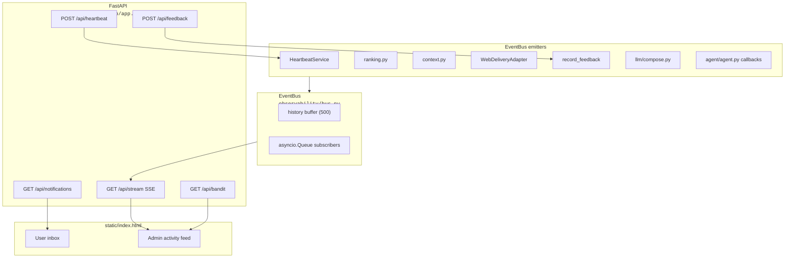

**Event kinds:** `session`, `context`, `intelligence`, `activity`, `indicator`, `notification`, `feedback`, `turn`, `tool_call`, `cluster`, `search`

---

## 9. ADK agent + MCP

**ADK agent** (`kairos agent-cycle` or `heartbeat --via-agent`) fetches Calendar/Gmail via **Workspace MCP**, calls `fuse_headspace_context`, then `run_heartbeat`. **Kairos MCP** (`kairos mcp`) exposes policy tools directly — use `sync_google_headspace` for Calendar/Gmail fetch + fuse. Both call the same `HeartbeatService`.

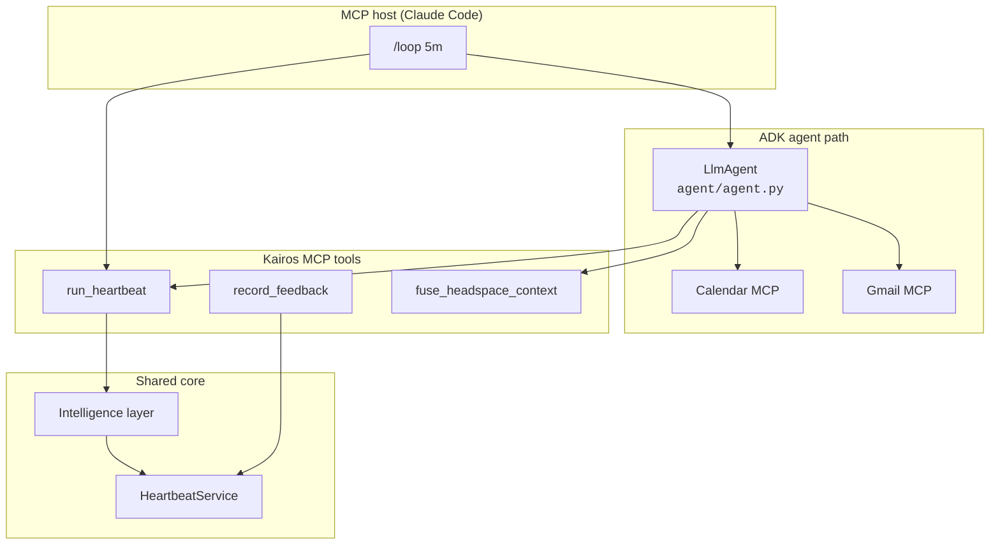

Direct CLI and web paths skip ADK orchestration but run the same intelligence + policy:

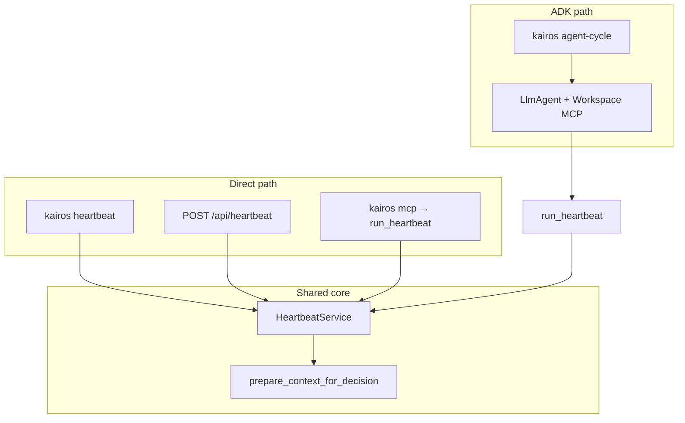

| Tool (MCP + harness) | Status | Purpose |
|------|--------|---------|
| `run_heartbeat` | ✅ | Policy cycle |
| `record_feedback` | ✅ | Bandit update |
| `get_current_context` | ✅ | Headspace (stub until Calendar MCP wired) |
| `get_cluster_summary` | ✅ | Topic → cluster lookup |
| `get_relevant_bookmarks` | ✅ | Semantic search over bookmark index (not thesis) |
| `add_bookmark` | — | Not exposed; use `kairos x sync` |

---

## 10. CLI surface

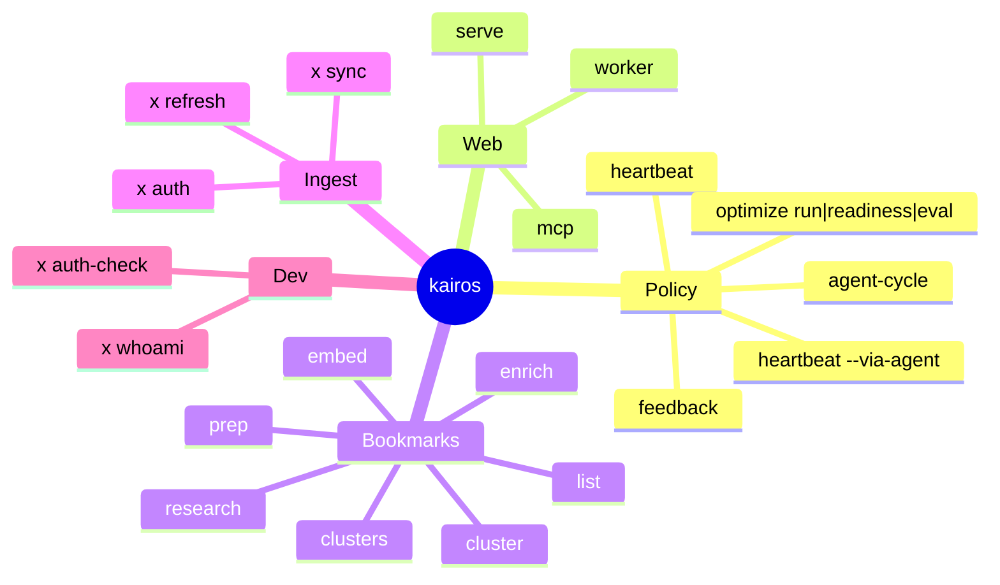

---

## 11. MongoDB collections

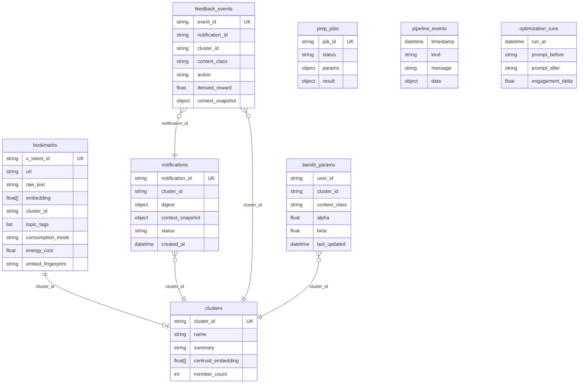

Collections also include `context_cache`, `google_tokens`, and `optimization_runs` (GEPA prompt diffs).

---

## 12. LLM layer

Structured generation uses the Gemini Interactions API. The **intelligence layer** runs on every heartbeat tick and on the surface path.

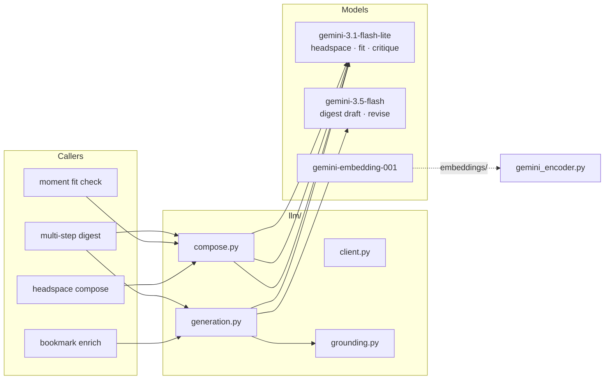

**Digest pipeline:** structured draft → optional Google Search grounding → LLM critique → revise if weak (`INTELLIGENCE_DIGEST_MULTISTEP`).

**Env flags:** `INTELLIGENCE_HEADSPACE_ENABLED`, `INTELLIGENCE_MOMENT_FIT_CHECK`, `INTELLIGENCE_DIGEST_MULTISTEP`, `DIGEST_USE_GOOGLE_SEARCH`.

---

## 13. Self-improvement

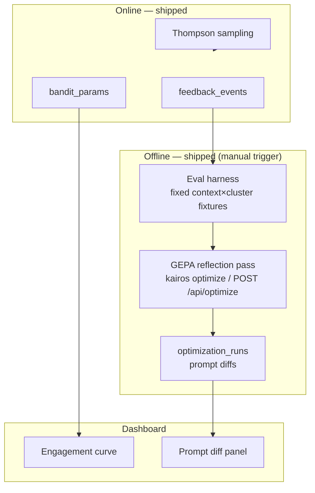

**Not yet automated:** nightly Cloud Run cron for GEPA when `gepa_ready` (see [TECH_DEBT.md](TECH_DEBT.md) P3).

---

## 14. End-to-end lifecycle

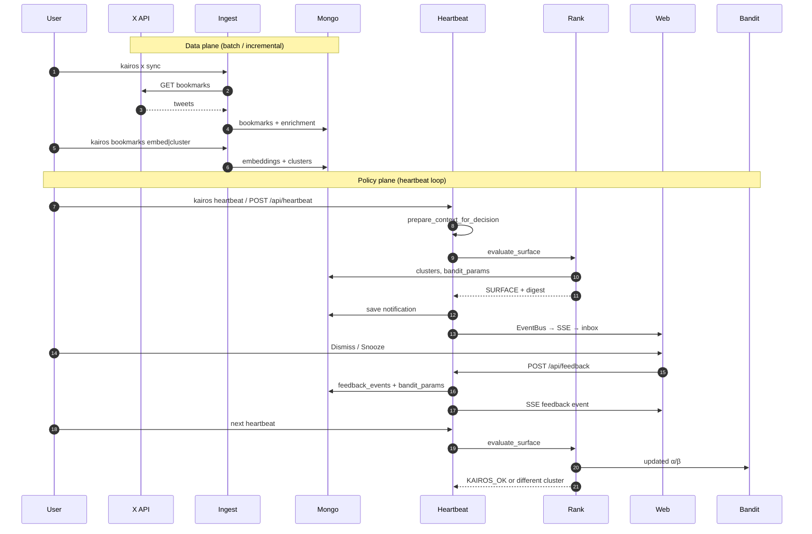

---

## 15. Configuration

Central settings in `config.py` (env + `.env`):

| Setting | Default | Effect |
|---------|---------|--------|
| `EMBEDDING_BACKEND` | `gemini` | Vector encoder dispatch |
| `DAILY_SURFACE_BUDGET` | `3` | Max surfaces / day |
| `SURFACE_SCORE_THRESHOLD` | `0.12` | Min adjusted score |
| `MIN_CALENDAR_GAP_MINUTES` | `30` | Attention capacity gate |
| `SNOOZE_TTL_MINUTES` | `120` | Snooze exclusion window |
| `DIGEST_USE_GOOGLE_SEARCH` | `true` | Ground digest with web |
| `INTELLIGENCE_HEADSPACE_ENABLED` | `true` | LLM headspace + moment narrative |
| `INTELLIGENCE_MOMENT_FIT_CHECK` | `true` | LLM gate before digest |
| `INTELLIGENCE_DIGEST_MULTISTEP` | `true` | Critique + revise digest (off when runtime fast) |
| `INTELLIGENCE_DIGEST_RUNTIME_FAST` | `false` | Single LLM digest call at surface (demo: `true`) |
| `CLUSTER_ID_REUSE_THRESHOLD` | `0.88` | Keep cluster_id when centroid matches |
| `EVENT_PERSIST_ENABLED` | `true` | Persist pipeline events to Mongo for SSE replay |
| `JOB_BACKEND` | `local` | `local` or `arq` for prep jobs |
| `HEARTBEAT_DEFAULT_VIA_AGENT` | `false` | Web heartbeat uses ADK when true |
| `GEPA_ENABLED` | `true` | Enable GEPA reflection pass |
| `DELIVERY_TARGETS` | `web` | Adapter fan-out |

---

## Module index

```
src/kairos/
├── cli.py                 # CLI entry
├── config.py              # Settings
├── agent/                 # ADK agent + MCP tools
├── bookmarks/             # Enrich, research, embed, cluster, pipeline, prep jobs
├── jobs/                  # Arq worker + dispatch (optional queue)
├── core/                  # Policy + intelligence: context, ranking, bandit, optimize
│   ├── intelligence.py    # fuse_headspace_intelligent, prepare_context
│   └── eval_harness.py    # GEPA fixture eval
├── models/                # Pydantic: schemas, jobs, optimize
├── llm/                   # Gemini generation, compose, interactions
├── db/                    # MongoDB repositories
├── delivery/              # Web + OS adapters
├── embeddings/            # Local + Gemini encoders
├── ingest/                # X OAuth, sync, normalize
├── observability/         # EventBus + Mongo pipeline_events
├── web/                   # FastAPI + static dashboard
└── mcp/                   # FastMCP server (stdio)
```

---

## Related docs

- [PLAN.md](../PLAN.md) — product thesis and original build order
- [TECH_DEBT.md](TECH_DEBT.md) — simplification roadmap + what's next
- [LOCAL_QUEUE.md](LOCAL_QUEUE.md) — optional Arq prep queue
- [demo-readiness/DEMO.md](demo-readiness/DEMO.md) — stage runbook
- [demo-readiness/FAQ.md](demo-readiness/FAQ.md) — judge Q&A
- [archive/](archive/) — hackathon phase logs + research notes
